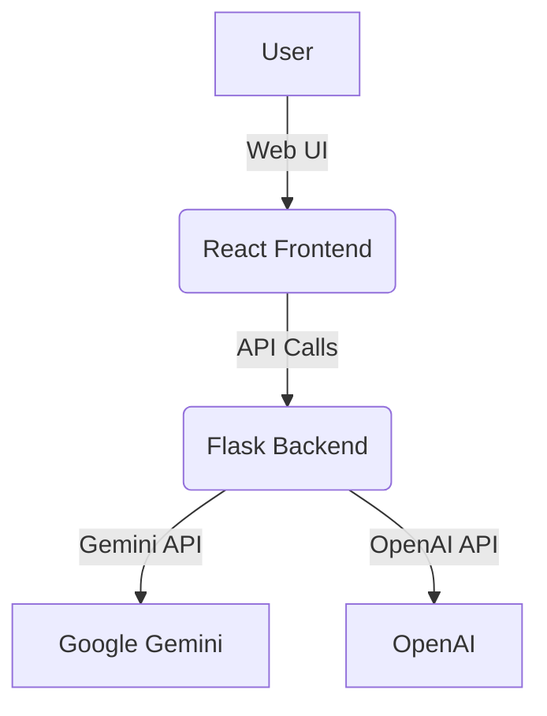

# AI Agent Web Application

This project is a full-stack sample web application demonstrating how to communicate with Large Language Models (LLMs) such as Gemini and OpenAI. It consists of:
- **Backend:** A Flask API that provides endpoints for interacting with Gemini and OpenAI LLMs.
- **Frontend:** A React-based UI for sending requests and displaying responses from the LLMs.

---

## Table of Contents

- [Features](#features)
- [Architecture](#architecture)
- [Backend Setup](#backend-setup)
- [Frontend Setup](#frontend-setup)
- [Running with Docker Compose](#running-with-docker-compose)
- [Configuration](#configuration)
- [API Usage](#api-usage)
- [Development & Production](#development--production)
- [License](#license)

---

## Features

- Sample integration with Gemini and OpenAI LLMs.
- Simple REST API for sending prompts and receiving responses from LLMs.
- Modern React UI for user interaction.
- Dockerized for easy deployment and development.

---

## Architecture



---

## Backend Setup

### Requirements

- Python 3.10+
- Flask, Flask-CORS, google-generativeai, python-dotenv

### Install & Run

```bash
cd back-end
python -m venv venv
source venv/bin/activate  # On Windows: venv\Scripts\activate
pip install -r requirements.txt
# Set environment variables (see Configuration)
python app.py
```

Or use Docker:

```bash
cd back-end
docker build -t ai-backend .
docker run -p 5000:5000 --env-file .env ai-backend
```

---

## Frontend Setup

### Requirements

- Node.js 18+

### Install & Run

```bash
cd react
npm install
npm start
```

Or use Docker:

```bash
cd react
docker build -t ai-frontend .
docker run -p 3000:3000 ai-frontend
```

---

## Running with Docker Compose

To run both backend and frontend together:

```bash
# Development mode
COMPOSE_PROFILES=dev docker-compose up --build

# Production mode
COMPOSE_PROFILES=prod FLASK_ENV=production REACT_APP_ENV=production docker-compose up --build
```

- Backend: [http://localhost:5000](http://localhost:5000)
- Frontend: [http://localhost:3000](http://localhost:3000) (dev) or [http://localhost](http://localhost) (prod)

---

## Configuration

Create a `.env` file in `back-end/` with:

```
GEMINI_API_KEY=your_gemini_api_key
OPENAI_API_KEY=your_openai_api_key
FLASK_DEBUG=True
FLASK_HOST=0.0.0.0
FLASK_PORT=5000
```

- `GEMINI_API_KEY` and `OPENAI_API_KEY` are required for their respective models.
- `FLASK_DEBUG` enables debug mode.
- `FLASK_HOST` and `FLASK_PORT` set the server address.

---

## API Usage

### POST `/api/classify`

**Request:**
```json
{
  "text": "Your prompt here",
  "model": "gemini" // or "openai"
}
```

**Response:**
```json
{
  "result": "LLM response"
}
```

---

## Development & Production

- **Development:** Hot-reloading, mapped volumes, ports 3000 (frontend) and 5000 (backend).
- **Production:** Static build served by Nginx (frontend), Gunicorn (backend), port 80 (frontend), port 5000 (backend).

---

## License

MIT 
